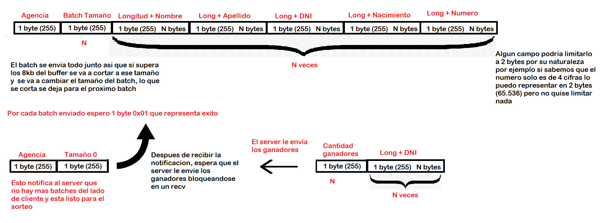
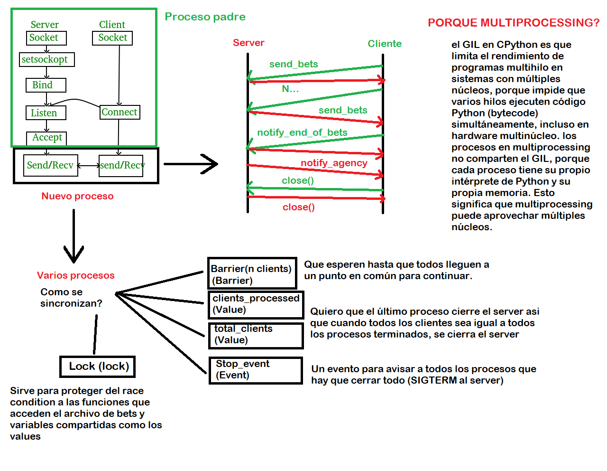

# TP0: Docker + Comunicaciones + Concurrencia

En el presente repositorio se provee un esqueleto básico de cliente/servidor, en donde todas las dependencias del mismo se encuentran encapsuladas en containers. Los alumnos deberán resolver una guía de ejercicios incrementales, teniendo en cuenta las condiciones de entrega descritas al final de este enunciado.

El cliente (Golang) y el servidor (Python) fueron desarrollados en diferentes lenguajes simplemente para mostrar cómo dos lenguajes de programación pueden convivir en el mismo proyecto con la ayuda de containers, en este caso utilizando [Docker Compose](https://docs.docker.com/compose/).

## Instrucciones de uso

El repositorio cuenta con un **Makefile** que incluye distintos comandos en forma de targets. Los targets se ejecutan mediante la invocación de: **make \<target\>**. Los target imprescindibles para iniciar y detener el sistema son **docker-compose-up** y **docker-compose-down**, siendo los restantes targets de utilidad para el proceso de depuración.

Los targets disponibles son:

| target                | accion                                                                                                                                                                                                                                                                                                                                                                |
| --------------------- | --------------------------------------------------------------------------------------------------------------------------------------------------------------------------------------------------------------------------------------------------------------------------------------------------------------------------------------------------------------------- |
| `docker-compose-up`   | Inicializa el ambiente de desarrollo. Construye las imágenes del cliente y el servidor, inicializa los recursos a utilizar (volúmenes, redes, etc) e inicia los propios containers.                                                                                                                                                                                   |
| `docker-compose-down` | Ejecuta `docker-compose stop` para detener los containers asociados al compose y luego `docker-compose down` para destruir todos los recursos asociados al proyecto que fueron inicializados. Se recomienda ejecutar este comando al finalizar cada ejecución para evitar que el disco de la máquina host se llene de versiones de desarrollo y recursos sin liberar. |
| `docker-compose-logs` | Permite ver los logs actuales del proyecto. Acompañar con `grep` para lograr ver mensajes de una aplicación específica dentro del compose.                                                                                                                                                                                                                            |
| `docker-image`        | Construye las imágenes a ser utilizadas tanto en el servidor como en el cliente. Este target es utilizado por **docker-compose-up**, por lo cual se lo puede utilizar para probar nuevos cambios en las imágenes antes de arrancar el proyecto.                                                                                                                       |
| `build`               | Compila la aplicación cliente para ejecución en el _host_ en lugar de en Docker. De este modo la compilación es mucho más veloz, pero requiere contar con todo el entorno de Golang y Python instalados en la máquina _host_.                                                                                                                                         |

### Servidor

Se trata de un "echo server", en donde los mensajes recibidos por el cliente se responden inmediatamente y sin alterar.

Se ejecutan en bucle las siguientes etapas:

1. Servidor acepta una nueva conexión.
2. Servidor recibe mensaje del cliente y procede a responder el mismo.
3. Servidor desconecta al cliente.
4. Servidor retorna al paso 1.

### Cliente

se conecta reiteradas veces al servidor y envía mensajes de la siguiente forma:

1. Cliente se conecta al servidor.
2. Cliente genera mensaje incremental.
3. Cliente envía mensaje al servidor y espera mensaje de respuesta.
4. Servidor responde al mensaje.
5. Servidor desconecta al cliente.
6. Cliente verifica si aún debe enviar un mensaje y si es así, vuelve al paso 2.

### Ejemplo

Al ejecutar el comando `make docker-compose-up` y luego `make docker-compose-logs`, se observan los siguientes logs:

```
client1  | 2024-08-21 22:11:15 INFO     action: config | result: success | client_id: 1 | server_address: server:12345 | loop_amount: 5 | loop_period: 5s | log_level: DEBUG
client1  | 2024-08-21 22:11:15 INFO     action: receive_message | result: success | client_id: 1 | msg: [CLIENT 1] Message N°1
server   | 2024-08-21 22:11:14 DEBUG    action: config | result: success | port: 12345 | listen_backlog: 5 | logging_level: DEBUG
server   | 2024-08-21 22:11:14 INFO     action: accept_connections | result: in_progress
server   | 2024-08-21 22:11:15 INFO     action: accept_connections | result: success | ip: 172.25.125.3
server   | 2024-08-21 22:11:15 INFO     action: receive_message | result: success | ip: 172.25.125.3 | msg: [CLIENT 1] Message N°1
server   | 2024-08-21 22:11:15 INFO     action: accept_connections | result: in_progress
server   | 2024-08-21 22:11:20 INFO     action: accept_connections | result: success | ip: 172.25.125.3
server   | 2024-08-21 22:11:20 INFO     action: receive_message | result: success | ip: 172.25.125.3 | msg: [CLIENT 1] Message N°2
server   | 2024-08-21 22:11:20 INFO     action: accept_connections | result: in_progress
client1  | 2024-08-21 22:11:20 INFO     action: receive_message | result: success | client_id: 1 | msg: [CLIENT 1] Message N°2
server   | 2024-08-21 22:11:25 INFO     action: accept_connections | result: success | ip: 172.25.125.3
server   | 2024-08-21 22:11:25 INFO     action: receive_message | result: success | ip: 172.25.125.3 | msg: [CLIENT 1] Message N°3
client1  | 2024-08-21 22:11:25 INFO     action: receive_message | result: success | client_id: 1 | msg: [CLIENT 1] Message N°3
server   | 2024-08-21 22:11:25 INFO     action: accept_connections | result: in_progress
server   | 2024-08-21 22:11:30 INFO     action: accept_connections | result: success | ip: 172.25.125.3
server   | 2024-08-21 22:11:30 INFO     action: receive_message | result: success | ip: 172.25.125.3 | msg: [CLIENT 1] Message N°4
server   | 2024-08-21 22:11:30 INFO     action: accept_connections | result: in_progress
client1  | 2024-08-21 22:11:30 INFO     action: receive_message | result: success | client_id: 1 | msg: [CLIENT 1] Message N°4
server   | 2024-08-21 22:11:35 INFO     action: accept_connections | result: success | ip: 172.25.125.3
server   | 2024-08-21 22:11:35 INFO     action: receive_message | result: success | ip: 172.25.125.3 | msg: [CLIENT 1] Message N°5
client1  | 2024-08-21 22:11:35 INFO     action: receive_message | result: success | client_id: 1 | msg: [CLIENT 1] Message N°5
server   | 2024-08-21 22:11:35 INFO     action: accept_connections | result: in_progress
client1  | 2024-08-21 22:11:40 INFO     action: loop_finished | result: success | client_id: 1
client1 exited with code 0
```

## Parte 1: Introducción a Docker

En esta primera parte del trabajo práctico se plantean una serie de ejercicios que sirven para introducir las herramientas básicas de Docker que se utilizarán a lo largo de la materia. El entendimiento de las mismas será crucial para el desarrollo de los próximos TPs.

### Ejercicio N°1:

Definir un script de bash `generar-compose.sh` que permita crear una definición de Docker Compose con una cantidad configurable de clientes. El nombre de los containers deberá seguir el formato propuesto: client1, client2, client3, etc.

El script deberá ubicarse en la raíz del proyecto y recibirá por parámetro el nombre del archivo de salida y la cantidad de clientes esperados:

`./generar-compose.sh docker-compose-dev.yaml 5`

Considerar que en el contenido del script pueden invocar un subscript de Go o Python:

```
#!/bin/bash
echo "Nombre del archivo de salida: $1"
echo "Cantidad de clientes: $2"
python3 mi-generador.py $1 $2
```

En el archivo de Docker Compose de salida se pueden definir volúmenes, variables de entorno y redes con libertad, pero recordar actualizar este script cuando se modifiquen tales definiciones en los sucesivos ejercicios.

### Ejercicio N°2:

Modificar el cliente y el servidor para lograr que realizar cambios en el archivo de configuración no requiera reconstruír las imágenes de Docker para que los mismos sean efectivos. La configuración a través del archivo correspondiente (`config.ini` y `config.yaml`, dependiendo de la aplicación) debe ser inyectada en el container y persistida por fuera de la imagen (hint: `docker volumes`).

### Ejercicio N°3:

Crear un script de bash `validar-echo-server.sh` que permita verificar el correcto funcionamiento del servidor utilizando el comando `netcat` para interactuar con el mismo. Dado que el servidor es un echo server, se debe enviar un mensaje al servidor y esperar recibir el mismo mensaje enviado.

En caso de que la validación sea exitosa imprimir: `action: test_echo_server | result: success`, de lo contrario imprimir:`action: test_echo_server | result: fail`.

El script deberá ubicarse en la raíz del proyecto. Netcat no debe ser instalado en la máquina _host_ y no se pueden exponer puertos del servidor para realizar la comunicación (hint: `docker network`). `

### Ejercicio N°4:

Modificar servidor y cliente para que ambos sistemas terminen de forma _graceful_ al recibir la signal SIGTERM. Terminar la aplicación de forma _graceful_ implica que todos los _file descriptors_ (entre los que se encuentran archivos, sockets, threads y procesos) deben cerrarse correctamente antes que el thread de la aplicación principal muera. Loguear mensajes en el cierre de cada recurso (hint: Verificar que hace el flag `-t` utilizado en el comando `docker compose down`).

## Parte 2: Repaso de Comunicaciones

Las secciones de repaso del trabajo práctico plantean un caso de uso denominado **Lotería Nacional**. Para la resolución de las mismas deberá utilizarse como base el código fuente provisto en la primera parte, con las modificaciones agregadas en el ejercicio 4.

### Ejercicio N°5:

Modificar la lógica de negocio tanto de los clientes como del servidor para nuestro nuevo caso de uso.

#### Cliente

Emulará a una _agencia de quiniela_ que participa del proyecto. Existen 5 agencias. Deberán recibir como variables de entorno los campos que representan la apuesta de una persona: nombre, apellido, DNI, nacimiento, numero apostado (en adelante 'número'). Ej.: `NOMBRE=Santiago Lionel`, `APELLIDO=Lorca`, `DOCUMENTO=30904465`, `NACIMIENTO=1999-03-17` y `NUMERO=7574` respectivamente.

Los campos deben enviarse al servidor para dejar registro de la apuesta. Al recibir la confirmación del servidor se debe imprimir por log: `action: apuesta_enviada | result: success | dni: ${DNI} | numero: ${NUMERO}`.

#### Servidor

Emulará a la _central de Lotería Nacional_. Deberá recibir los campos de la cada apuesta desde los clientes y almacenar la información mediante la función `store_bet(...)` para control futuro de ganadores. La función `store_bet(...)` es provista por la cátedra y no podrá ser modificada por el alumno.
Al persistir se debe imprimir por log: `action: apuesta_almacenada | result: success | dni: ${DNI} | numero: ${NUMERO}`.

#### Comunicación:

Se deberá implementar un módulo de comunicación entre el cliente y el servidor donde se maneje el envío y la recepción de los paquetes, el cual se espera que contemple:

- Definición de un protocolo para el envío de los mensajes.
- Serialización de los datos.
- Correcta separación de responsabilidades entre modelo de dominio y capa de comunicación.
- Correcto empleo de sockets, incluyendo manejo de errores y evitando los fenómenos conocidos como [_short read y short write_](https://cs61.seas.harvard.edu/site/2018/FileDescriptors/).

### Ejercicio N°6:

Modificar los clientes para que envíen varias apuestas a la vez (modalidad conocida como procesamiento por _chunks_ o _batchs_).
Los _batchs_ permiten que el cliente registre varias apuestas en una misma consulta, acortando tiempos de transmisión y procesamiento.

La información de cada agencia será simulada por la ingesta de su archivo numerado correspondiente, provisto por la cátedra dentro de `.data/datasets.zip`.
Los archivos deberán ser inyectados en los containers correspondientes y persistido por fuera de la imagen (hint: `docker volumes`), manteniendo la convencion de que el cliente N utilizara el archivo de apuestas `.data/agency-{N}.csv` .

En el servidor, si todas las apuestas del _batch_ fueron procesadas correctamente, imprimir por log: `action: apuesta_recibida | result: success | cantidad: ${CANTIDAD_DE_APUESTAS}`. En caso de detectar un error con alguna de las apuestas, debe responder con un código de error a elección e imprimir: `action: apuesta_recibida | result: fail | cantidad: ${CANTIDAD_DE_APUESTAS}`.

La cantidad máxima de apuestas dentro de cada _batch_ debe ser configurable desde config.yaml. Respetar la clave `batch: maxAmount`, pero modificar el valor por defecto de modo tal que los paquetes no excedan los 8kB.

Por su parte, el servidor deberá responder con éxito solamente si todas las apuestas del _batch_ fueron procesadas correctamente.

### Ejercicio N°7:

Modificar los clientes para que notifiquen al servidor al finalizar con el envío de todas las apuestas y así proceder con el sorteo.
Inmediatamente después de la notificacion, los clientes consultarán la lista de ganadores del sorteo correspondientes a su agencia.
Una vez el cliente obtenga los resultados, deberá imprimir por log: `action: consulta_ganadores | result: success | cant_ganadores: ${CANT}`.

El servidor deberá esperar la notificación de las 5 agencias para considerar que se realizó el sorteo e imprimir por log: `action: sorteo | result: success`.
Luego de este evento, podrá verificar cada apuesta con las funciones `load_bets(...)` y `has_won(...)` y retornar los DNI de los ganadores de la agencia en cuestión. Antes del sorteo no se podrán responder consultas por la lista de ganadores con información parcial.

Las funciones `load_bets(...)` y `has_won(...)` son provistas por la cátedra y no podrán ser modificadas por el alumno.

No es correcto realizar un broadcast de todos los ganadores hacia todas las agencias, se espera que se informen los DNIs ganadores que correspondan a cada una de ellas.

## Parte 3: Repaso de Concurrencia

En este ejercicio es importante considerar los mecanismos de sincronización a utilizar para el correcto funcionamiento de la persistencia.

### Ejercicio N°8:

Modificar el servidor para que permita aceptar conexiones y procesar mensajes en paralelo. En caso de que el alumno implemente el servidor en Python utilizando _multithreading_, deberán tenerse en cuenta las [limitaciones propias del lenguaje](https://wiki.python.org/moin/GlobalInterpreterLock).

## Condiciones de Entrega

Se espera que los alumnos realicen un _fork_ del presente repositorio para el desarrollo de los ejercicios y que aprovechen el esqueleto provisto tanto (o tan poco) como consideren necesario.

Cada ejercicio deberá resolverse en una rama independiente con nombres siguiendo el formato `ej${Nro de ejercicio}`. Se permite agregar commits en cualquier órden, así como crear una rama a partir de otra, pero al momento de la entrega deberán existir 8 ramas llamadas: ej1, ej2, ..., ej7, ej8.
(hint: verificar listado de ramas y últimos commits con `git ls-remote`)

Se espera que se redacte una sección del README en donde se indique cómo ejecutar cada ejercicio y se detallen los aspectos más importantes de la solución provista, como ser el protocolo de comunicación implementado (Parte 2) y los mecanismos de sincronización utilizados (Parte 3).

Se proveen [pruebas automáticas](https://github.com/7574-sistemas-distribuidos/tp0-tests) de caja negra. Se exige que la resolución de los ejercicios pase tales pruebas, o en su defecto que las discrepancias sean justificadas y discutidas con los docentes antes del día de la entrega. El incumplimiento de las pruebas es condición de desaprobación, pero su cumplimiento no es suficiente para la aprobación. Respetar las entradas de log planteadas en los ejercicios, pues son las que se chequean en cada uno de los tests.

La corrección personal tendrá en cuenta la calidad del código entregado y casos de error posibles, se manifiesten o no durante la ejecución del trabajo práctico. Se pide a los alumnos leer atentamente y **tener en cuenta** los criterios de corrección informados [en el campus](https://campusgrado.fi.uba.ar/mod/page/view.php?id=73393).

## Entrega TP 0

### Ejercicio 1:

El script deberá ubicarse en la raíz del proyecto y recibirá por parámetro el nombre del archivo de salida y la cantidad de clientes esperados:

`./generar-compose.sh docker-compose-dev.yaml 5`

que es el nombre utilizado por defecto en el Makefile, será necesario ejecutarlo manualmente o modificar el Makefile para que utilice el nombre correcto. Para hacerlo manualmente, primero se deben crear las imágenes ejecutando make docker-image. Luego, se lanza el contenedor con docker compose -f <nombre_archivo_salida> up -d --build.

El script también maneja errores en los parámetros de entrada, como ingresar un valor no numérico o negativo para la cantidad de clientes, o una cantidad incorrecta de argumentos, o un formato de archivo distinto de .yml o .yaml. En estos casos, se muestra un mensaje de error y el script se detiene.

### Ejercicio 3:

Se ha creado un script llamado `validar-echo-server.sh` que verifica el correcto funcionamiento del servidor echo utilizando `netcat`.

Para ejecutar el script de validación, asegúrate de que el servidor esté en funcionamiento y ejecuta:

```bash
./validar-echo-server.sh
```

Esto permitirá verificar que el servidor echo esté funcionando correctamente.

Se realizó un cambio en el script `generar-compose.sh` para que acepte 0 como cantidad de clientes. Este ajuste fue necesario para que los tests del Ejercicio 3 funcionen correctamente, permitiendo así la ejecución de pruebas sin requerir un número mínimo de clientes.

### Ejercicio 4:

He modificado tanto el servidor como el cliente para manejar de manera adecuada las señales SIGTERM, asegurando que todos los recursos (descriptores de archivo, sockets, etc.) se cierren correctamente antes de que la aplicación principal finalice.

En la implementación del cliente, he agregado un manejador de señales que captura SIGTERM. También implementé un método Stop() que utiliza un canal `stopCh chan struct{}` como mecanismo principal para coordinar la detención del loop del cliente. Sin embargo, si la ejecución está bloqueada en la operación `ReadString('\n')`, la verificación del canal `stopCh` no podrá realizarse hasta que la operación de lectura se complete o falle. Además de utilizar el canal, cierra la conexión, establece la conexión como nula tras un cierre exitoso y registra el cierre exitoso de la conexión. Este método es invocado por el manejador de señales cuando se recibe SIGTERM.

Para el servidor, he añadido una función manejadora de señales para SIGTERM y mejorado el método stop(). Este método ahora registra el inicio del cierre del socket, establece una bandera de ejecución en falso, cierra correctamente el socket utilizando SHUT_RDWR, y registra el cierre exitoso del socket, manejando también posibles errores durante este proceso.

Además, se ha implementado un sistema de logging estructurado para todas las operaciones, que registra eventos como action: shutdown_initiated al recibir SIGTERM, así como action: close_connection y action: close_socket durante el cierre de recursos.

### Ejercicio 4: Actualización

Este ejercicio implementa una mejora en el mecanismo de cierre del servidor, reemplazando el enfoque anterior de `shutdown` + `sys.exit(0)` por un método más elegante que utiliza un socket ficticio (dummy socket) para interrumpir el bloqueo causado por la llamada `accept()`.

#### Problema a Resolver

El servidor TCP queda bloqueado en la llamada `accept()` cuando está esperando conexiones entrantes. Cuando se desea cerrar el servidor (por ejemplo, al recibir una señal `SIGTERM`), el hilo principal queda bloqueado en esta llamada, lo que impide un cierre limpio y ordenado del servidor.

#### Solución Implementada

Para resolver este problema, se ha implementado una técnica que consiste en:

1. Cambiar el estado interno del servidor (`self._running = False`).
2. Crear un socket dummy que se conecta al propio servidor.
3. Esta conexión hace que el método `accept()` se desbloquee.
4. Al salir del bloqueo, se verifica el estado `self._running` para decidir si continuar o terminar.

#### Método de Detención del Servidor

```python
def stop(self):
    """Stops the server and closes the socket"""
    logging.info("action: close_socket | result: in_progress")
    self._running = False
    try:
        dummy_socket = socket.socket(socket.AF_INET, socket.SOCK_STREAM)
        server_address = self._server_socket.getsockname()
        dummy_socket.connect(('localhost', server_address[1]))
    except OSError as e:
        logging.error(f"action: close_socket | result: error | error: {e}")
    finally:
        try:
            dummy_socket.shutdown(socket.SHUT_RDWR)
        except OSError as e:
            logging.error(f"action: shutdown_dummy_socket | result: error | error: {e}")
        dummy_socket.close()
```

#### Bucle Principal del Servidor Mejorado

```python
while self._running:
    try:
        client_sock = self.__accept_new_connection()
        if client_sock and self._running:
            self.__handle_client_connection(client_sock)
    except Exception as e:
        logging.error(f"Error en el servidor: {e}")
        self.stop()

self._server_socket.shutdown(socket.SHUT_RDWR)
self._server_socket.close()
logging.info("action: close_socket | result: success")
```

#### Flujo de Ejecución

1. **Estado Normal de Ejecución**:

   - El servidor se ejecuta en un bucle infinito `while self._running`.
   - En cada iteración, se bloquea en `accept_new_connection()` esperando conexiones de clientes.

2. **Iniciando el Cierre**:

   - Cuando se requiere cerrar el servidor, se llama al método `stop()`.
   - El método cambia `self._running = False`.
   - Crea un socket dummy y se conecta al servidor para desbloquear `accept()`.

3. **Procesando el Cierre**:

   - La conexión dummy hace que el servidor salga del bloqueo en `accept()`.
   - El bucle verifica `if client_sock and self._running`.
   - Como `self._running` es `False`, no se procesa la conexión dummy.
   - El bucle principal termina y se ejecutan las operaciones de limpieza.

4. **Limpieza Final**:
   - Se cierra correctamente el socket del servidor con `shutdown()` y `close()`.
   - Se registra el cierre exitoso en el log.

#### Ventajas de Esta Implementación

- **Cierre Limpio**: Permite que el servidor se cierre de manera ordenada.
- **No Forzado**: Evita el uso de `sys.exit(0)` que termina abruptamente la ejecución.
- **Robusto**: Maneja correctamente los errores que pueden ocurrir durante el cierre.
- **Controlado**: Permite un adecuado manejo de recursos antes de finalizar.

#### Consideraciones de Implementación

- Es crucial verificar `self._running` después de `accept()` para ignorar la conexión del socket dummy.
- El método `shutdown()` se utiliza tanto en el socket dummy como en el socket del servidor para asegurar un cierre completo.
- Se implementan bloques `try/except` para manejar posibles errores durante el proceso de cierre.

### Ejercicio 5

El protocolo se basa en la serialización de varios campos de datos que se envían entre el cliente y el servidor. Los datos están organizados en bloques de información, cada uno con un identificador y longitud específica. A continuación, se describe la estructura detallada de los datos enviados.

## Campos del Protocolo

Los siguientes campos están involucrados en el protocolo de comunicación:

- **Agencia (1 byte)**: Este campo representa el identificador de la agencia (un número entre 1 y 255). Este campo no tiene un identificador asociado y se transmite como el primer byte con su valor.

- **NOMBRE (1 byte de longitud + N bytes de valor)**: Este campo almacena el nombre del cliente. La longitud del nombre está indicada por el primer byte, y los bytes siguientes contienen el valor del nombre.

- **APELLIDO (1 byte de longitud + N bytes de valor)**: Similar al campo NOMBRE, este campo contiene el apellido del cliente. La longitud se especifica con un byte, y los bytes siguientes contienen el valor del apellido.

- **DNI (1 byte de longitud + N bytes de valor)**: El número de documento de identidad del cliente. Al igual que los otros campos, su longitud está indicada por el primer byte y el valor por los bytes siguientes.

- **NACIMIENTO (1 byte de longitud + N bytes de valor)**: Fecha de nacimiento del cliente en formato de texto. Este campo se estructura de la misma forma que los anteriores.

- **NUMERO (1 byte de longitud + N bytes de valor)**: El número de apuesta proporcionado por el cliente. Este campo también sigue el mismo formato que los anteriores.

## Especificaciones

**Endianess**: Los campos que requieren longitud (por ejemplo, los campos de texto) se codifican en Big Endian.
**Longitud de los Campos**: Cada campo tiene un byte que indica su longitud. Este valor de longitud es un número entero de 1 byte (valor máximo de 255), por lo que los campos no pueden exceder los 255 bytes.

## Respuesta del Servidor

El servidor responde con un byte que indica si la operación fue exitosa o no:

- **STATUS_SUCCESS (0x01)**: Indica que la apuesta fue procesada con éxito.
- **STATUS_ERROR (0x00)**: Indica que ocurrió un error en el procesamiento de la apuesta.

## Flujo de Comunicación

El flujo de comunicación entre el cliente y el servidor sigue estos pasos:

1. **Cliente**: El cliente primero envía los datos en el siguiente orden:

   - Agencia (1 byte)
   - Nombre
   - Apellido
   - DNI
   - Nacimiento
   - Número de apuesta

2. **Servidor**: El servidor procesa los datos, los almacena (o maneja cualquier error que ocurra) y devuelve una respuesta de éxito o error mediante un solo byte.

## Detalles del Cliente

El cliente envía el mismo bet de manera continua en un bucle en `StartClientLoop`, utilizando las variables de entorno para definir los valores a enviar. Si alguna de estas variables de entorno no está definida, el cliente recurrirá a valores predeterminados. Este enfoque se implementa porque el objetivo principal del ejercicio es el protocolo de comunicación. Entonces parte del comportamiento del cliente de los ejercicios anteriores se mantuvo ya que lo que se espera es que el cliente reciba como variables de entorno los campos que representan la apuesta de una persona y los envíe al servidor.

### Ejercicio 6

Este ejercicio implementa un sistema de procesamiento de apuestas en batch con ajustes dinámicos basados en restricciones de tamaño y cantidad. El sistema optimiza la transmisión de datos entre clientes y servidor, evitando la pérdida de apuestas debido a limitaciones en el buffer de salida.

#### Características Principales

- **Ajuste dinámico de batches**: El sistema ajusta automáticamente el número de apuestas por batch según dos restricciones:

  - Máximo 255 apuestas por batch (limitación de 1 byte).
  - Tamaño máximo de 8KB por batch.

- **Persistencia de apuestas**: Las apuestas que no pueden incluirse en un batch debido a las restricciones se almacenan para su inclusión en el siguiente batch.

- **Configuración flexible**: Los parámetros de batch se definen en `config.yaml` bajo la clave `batch: maxAmount`.

#### Cliente

1. **Lectura de datos**: Cada cliente lee apuestas desde su archivo correspondiente en `.data/agency-{N}.csv`.

2. **Formación de batches**:

   - Si el número de apuestas supera 255, se limita a 255 y se muestra una advertencia:
     ```
     WARNI BatchSize ({total_apuestas}) excede el límite de 1 byte. Se procesarán solo 255 apuestas.
     ```
   - Si el tamaño del batch excede 8KB después del primer ajuste, se reduce aún más:
     ```
     WARNI BatchSize ({apuestas_actualizadas}) exceden los 8kb. Se ajustará a {nuevo_límite}.
     ```

3. **Envío de datos**: El cliente envía los batches con el siguiente formato:

   - 1 byte para el ID de agencia.
   - 1 byte para la cantidad de apuestas en el batch.
   - Para cada apuesta:
     - NOMBRE (1 byte longitud + N bytes valor)
     - APELLIDO (1 byte longitud + N bytes valor)
     - DNI (1 byte longitud + N bytes valor)
     - NACIMIENTO (1 byte longitud + N bytes valor)
     - NUMERO (1 byte longitud + N bytes valor)

   Las apuestas no enviadas se guardan para el siguiente batch.

#### Servidor

1. **Procesamiento de batches**: El servidor procesa cada batch recibido.

2. **Respuestas**:
   - **Éxito**: Si todas las apuestas son procesadas correctamente:
     ```
     INFO action: apuesta_recibida | result: success | cantidad: {CANTIDAD_DE_APUESTAS}
     ```
   - **Error**: Si hay un error en la lectura:
     ```
     INFO action: apuesta_recibida | result: fail | cantidad: {CANTIDAD_DE_APUESTAS}
     ```

#### Parámetros de Configuración

Los parámetros del sistema se definen en `config.yaml`:

```yaml
batch:
  maxAmount: Número máximo de apuestas por batch (se ajustará automáticamente si es necesario)
```

#### Limitaciones y Consideraciones

- Máximo 255 apuestas por batch (limitación de representación en 1 byte).
- Tamaño máximo de batch de 8KB.
- Los nombres, apellidos, DNIs, fechas de nacimiento y números de apuesta deben poder representarse cada uno con una longitud en 1 byte.

#### Actualización del Generador de Docker-Compose

Se ha actualizado el script `generar_compose.py` para incluir automáticamente los archivos CSV de apuestas en los volúmenes de los contenedores cliente. La parte clave del código que implementa esta funcionalidad es:

```python
client_configs = {}
for i in range(1, num_clientes + 1):
    client_name = f"client{i}"
    csv_filename = f"agency-{i}.csv"

    client_configs[client_name] = {
        "container_name": client_name,
        "image": "client:latest",
        "entrypoint": "/client",
        "environment": [
            f"CLI_ID={i}",
        ],
        "volumes": [
            "./client/config.yaml:/config.yaml",
            f"./.data/{csv_filename}:/{csv_filename}"
        ],
        "networks": ["testing_net"],
        "depends_on": ["server"]
    }
```

#### Funcionamiento de los Volúmenes

El sistema carga los archivos CSV de apuestas desde un directorio host `.data/` y los mapea dentro de cada contenedor cliente:

- Cada cliente tiene acceso a su propio archivo de apuestas correspondiente.
- Los archivos se mantienen persistentes fuera de los contenedores.
- El formato del mapeo de volumen es: `./.data/agency-{N}.csv:/{csv_filename}`.

### Ejercicio 7:

Este ejercicio modifica un sistema cliente-servidor para manejar apuestas y realizar un sorteo. Los clientes notifican al servidor al terminar de enviar apuestas, y el servidor espera a que todas las agencias finalicen antes de proceder con el sorteo. Luego, los clientes consultan los ganadores de su agencia y registran los resultados en logs. El servidor utiliza las funciones `load_bets()` y `has_won()` para determinar ganadores, enviando solo los DNIs correspondientes a cada agencia.

#### Características Principales

- **Notificación de Fin**: Los clientes envían un mensaje con `batch_size = 0` al terminar de enviar apuestas y consultan los ganadores inmediatamente.
- **Espera Dinámica**: El servidor registra las agencias vistas y espera todas las notificaciones antes de realizar el sorteo.

- **Respuesta Específica**: Solo se envían los DNIs de los ganadores por agencia, sin realizar un broadcast.

- **Logs**:

  - Cliente: `action: consulta_ganadores | result: success | cant_ganadores: ${CANT}`.
  - Servidor: `action: sorteo | result: success`.

- **Restricción**: No se permiten consultas de ganadores antes de que todas las agencias notifiquen su fin.

#### Implementación

##### Cliente

Los clientes están implementados en Go y se modificaron para notificar el fin de apuestas y consultar los ganadores.

- **Notificación de Fin**: En `StartClientLoop`, cuando `len(bets) == 0`, se llama a `notify_end_of_bets(agencyID)` enviando el `agencyID` y `batch_size = 0`. Se espera confirmación (STATUS_SUCCESS).

- **Consulta de Ganadores**: Tras la notificación, se invoca `read_winners(agencyID)` para leer la respuesta del servidor, que incluye la cantidad de ganadores y sus DNIs, registrando el resultado en el log.

```go
if len(bets) == 0 {
    c.protocol.notify_end_of_bets(agencyID)
    winners, err := c.protocol.read_winners(agencyID)
    if err != nil {
        log.Errorf("Error al leer ganadores: %v", err)
        return
    }
    log.Infof("action: consulta_ganadores | result: success | cant_ganadores: %d", len(winners))
    break
}

func (p *ProtocolClient) notify_end_of_bets(agencia int) error {
    var buffer bytes.Buffer
    buffer.WriteByte(byte(agencia))
    buffer.WriteByte(0) // Tamaño de batch 0 indica fin
    _, err := p.conn.Write(buffer.Bytes())
    // ... (lectura de confirmación)
    log.Infof("action: notificacion_fin | result: success | agencia: %d", agencia)
    return nil
}

func (p *ProtocolClient) read_winners(agencia int) ([]string, error) {
    // Lee cantidad (1 byte) y DNIs (longitud + datos)
    // ...
}
```

##### Servidor

El servidor está implementado en Python y se ajustó para esperar notificaciones, realizar el sorteo y responder con los ganadores.

- **Registro Dinámico**: Utiliza `self.all_agencies` (un set) para rastrear las agencias vistas y `self.agency_sockets` para guardar los sockets de las agencias que envían `batch_size == 0`.

- **Sorteo**: Ejecuta `perform_draw()` cuando `len(self.agency_sockets) >= len(self.all_agencies)`, utilizando `load_bets()` y `has_won()` para determinar los ganadores y notificar a cada agencia.

- **Protocolo de Respuesta**: En el método `notify_all_agencies`, el servidor envía:
  - 1 byte: Cantidad de ganadores.
  - Por cada ganador: 1 byte (longitud del DNI) + bytes del DNI (codificado en UTF-8).

```python
class ServerProtocol:
    def __init__(self):
        self.agency_sockets = {}  # Sockets de agencias que terminaron
        self.all_agencies = set()  # Todas las agencias vistas
        self.draw_done = False
        self.winners = {}

    def handle_client(self, conn):
        agency = self.read_exact(conn, 1)[0]
        self.all_agencies.add(agency)  # Registrar agencia
        batch_size = self.read_exact(conn, 1)[0]

        if batch_size == 0:
            self.agency_sockets[agency] = conn
            conn.sendall(bytes([self.STATUS_SUCCESS]))
            if len(self.agency_sockets) >= len(self.all_agencies) and not self.draw_done:
                self.draw_done = True
            return self.draw_done
        # ... (procesamiento de apuestas)

    def perform_draw(self):
        all_bets = load_bets()
        winners_by_agency = {}
        for bet in all_bets:
            if has_won(bet):
                winners_by_agency.setdefault(bet.agency, []).append(bet.document)
        self.winners = winners_by_agency
        self.notify_all_agencies()
```

#### Flujo de Ejecución

1. **Clientes envían apuestas**: Cada cliente envía batches de apuestas al servidor, que registra las agencias en `self.all_agencies`.

2. **Notificación de Fin**: Cuando un cliente termina, envía `batch_size = 0`. El servidor guarda el socket en `self.agency_sockets` y envía una confirmación.

3. **Sorteo**: Cuando todas las agencias han enviado su notificación, el servidor realiza el sorteo y registra `action: sorteo | result: success`.

4. **Notificación de Ganadores**: El servidor envía a cada agencia conectada la cantidad de ganadores y sus DNIs específicos.

5. **Clientes reciben resultados**: Cada cliente lee la respuesta y registra `action: consulta_ganadores | result: success | cant_ganadores: ${CANT}`.

6. **Cierre**: El servidor cierra todas las conexiones y se detiene llamando a `self.stop()`.

#### Limitaciones y Consideraciones

- **Agencias Inactivas**: Si una agencia envía apuestas pero no notifica su fin, el servidor realizará el sorteo cuando se agote el tiempo de espera (timeout) mientras espera la última conexión.

- **Conexiones Abiertas**: Los sockets se mantienen activos tras `batch_size = 0` hasta que se envían los resultados.

### Ejercicio 8:

Este ejercicio modifica el servidor para aceptar conexiones y procesar mensajes de múltiples clientes en paralelo utilizando multithreading en Python.

#### Características Principales

- **Procesamiento Paralelo**: El servidor utiliza hilos (`threading.Thread`) para manejar cada conexión de cliente de forma independiente, permitiendo procesar apuestas de múltiples agencias simultáneamente.

- **Sincronización con Barrera**: Se emplea un `threading.Barrier` para asegurar que todos los subprocesos de clientes válidos esperen antes de realizar el sorteo (`perform_draw()`). La barrera se inicializa dinámicamente con `self._total_clients` al aceptar cada conexión.

- **Manejo de Fallos**: Si un cliente falla al procesar apuestas (cuando `handle_client` retorna `False`), su subproceso en el servidor cierra el socket, espera al número original de participantes en la barrera (`self._total_clients`) y no ejecuta `perform_draw()`.

- **Cierre Automático**: El servidor se detiene automáticamente después de que todos los subprocesos válidos completan el sorteo, utilizando un contador (`self._clients_processed`) que se incrementa tras `perform_draw()`. El último subproceso en terminar llama a `self.stop()`.

#### Implementación

##### Cliente

Los clientes se modificaron para no tener que conectarse varias veces, realizando una única conexión.

- **Conexión Única**: En `StartClientLoop`, se invoca `createClientSocket()` una sola vez en lugar de múltiples veces como se hacía anteriormente.

- **Bloqueo Esperando los Ganadores**: Tras la notificación de fin de apuestas, se invoca `read_winners(agencyID)` para leer la respuesta del servidor. Dado que el SIGTERM no puede interrumpir este `recv` usando el canal de parada (`stopCh`), se aplica un `socket.close` al detener el cliente.

##### Servidor

El servidor utiliza multithreading para manejar conexiones en paralelo:

- **Aceptación de Conexiones**: En el método `run()`, se aceptan conexiones en un bucle y se lanza un hilo por cada cliente:

```python
client_thread = threading.Thread(
    target=self.__handle_client_connection,
    args=(client_sock,),
    daemon=True
)
client_thread.start()
```

- **Sincronización**: La barrera (`self._draw_barrier`) se crea dinámicamente con `Barrier(self._total_clients)` cada vez que se acepta un cliente, bajo la protección de `self._draw_lock`. Un contador (`self._clients_processed`) rastrea los subprocesos que completan `perform_draw()`. Cuando `self._clients_processed` es igual a `self._total_clients`, el último subproceso llama a `self.stop()`:

```python
with self._lock:
    self._clients_processed += 1
    if self._clients_processed == self._total_clients:
        self.stop()
```

- **Procesamiento por Subproceso**: En `__handle_client_connection`, cada subproceso sigue este flujo:

  1. Crea una instancia de `ServerProtocol` y ejecuta `handle_client()` para procesar apuestas.
  2. Espera un breve retraso (`time.sleep(1)`) para simular procesamiento adicional o dar tiempo a otros subprocesos.
  3. Participa en la barrera independientemente del resultado de `handle_client()`:

```python
logging.info(f'action: wait_for_barrier | result: in_progress | thread: {threading.current_thread().name}')
self._draw_barrier.wait()  # Todos los threads esperan aquí
logging.info(f'action: wait_for_barrier | result: success | thread: {threading.current_thread().name}')
```

4. Si `success` es `True`, realiza el sorteo; si `success` es `False`, omite el sorteo:

```python
if success:
    logging.info("action: sorteo | result: success | thread: {}".format(threading.current_thread().name))
    protocol.perform_draw()
```

- **Cierre del Servidor**: En `stop()`, se establece `self._running = False`, se aborta la barrera y se envía una conexión dummy para desbloquear `accept()`:

```python
with self._draw_lock:
    if self._draw_barrier:
        self._draw_barrier.abort()
```

#### Flujo de Ejecución

1. **Aceptación**: El servidor acepta conexiones y lanza subprocesos para cada cliente.
2. **Procesamiento**: Cada subproceso ejecuta `handle_client()` y espera en la barrera, independientemente del resultado.
3. **Sorteo**: Los subprocesos con `success = True` (sin errores) ejecutan `perform_draw()` tras pasar la barrera.
4. **Cierre**: El último subproceso exitoso incrementa `self._clients_processed` hasta `self._total_clients` y llama a `self.stop()`.

#### Limitaciones y Consideraciones

- **Global Interpreter Lock (GIL)**: El GIL limita la ejecución paralela de tareas CPU-bound en Python, pero este servidor es I/O-bound (lectura/escritura en sockets), por lo que el multithreading mejora el rendimiento al manejar múltiples conexiones simultáneamente.

- **Subprocesos Bloqueados en la Barrera**: Cuando un cliente se cierra (por ejemplo, vía `Stop()`), su subproceso correspondiente en el servidor no termina hasta que todos los subprocesos lleguen a la barrera (`self._draw_barrier.wait()`). Esto significa que incluso si un cliente falla o se desconecta, su subproceso permanece vivo esperando la sincronización.

- **Sincronización Dinámica**: La recreación de la barrera al aceptar cada cliente introduce riesgo de race condition si un subproceso espera en una barrera antigua mientras se crea una nueva. Por eso, hay un `sleep` antes del `wait` de la barrera para darle tiempo a los otros clientes a conectarse antes de que el primer cliente termine de enviar sus batches y entre en la barrera.

- **Cierre de Subprocesos**: Los subprocesos daemon (`daemon=True`) terminan al cerrar el programa, y `thread.join(timeout=0.1)` en `run()` limita la espera a 0.1 segundos por subproceso para evitar bloqueos prolongados.

### Ejercicio 8: Actualización

Este ejercicio modifica el servidor para aceptar conexiones y procesar mensajes de múltiples clientes en paralelo utilizando `multiprocessing`. Cada cliente se maneja en su propio proceso, y el servidor utiliza una barrera de sincronización para asegurar que todos los clientes estén listos antes de realizar el sorteo. Además, el servidor puede ser detenido de forma controlada mediante una señal SIGTERM, lo que asegura que todos los recursos sean liberados correctamente.

#### Características

- **Procesamiento en paralelo**: Cada cliente se maneja en un proceso independiente, lo que permite que múltiples clientes se conecten y procesen apuestas simultáneamente.

- **Sincronización con Barrera**: Usamos `multiprocessing.Manager().Barrier` para asegurar que todos los procesos esperen antes de realizar el sorteo.

- **Manejo de señales**: El servidor escucha señales del sistema como SIGTERM y detiene todos los procesos de clientes de manera ordenada.

- **Cierre controlado**: El servidor y sus procesos se detienen correctamente, asegurando el cierre adecuado de conexiones y la liberación de recursos.

#### Manejo de Señales (SIGTERM)

Cuando el servidor recibe una señal SIGTERM, se activa un evento llamado `stop_event`. Este evento es utilizado por los procesos de cliente para saber cuándo deben detenerse. Al activarse el `stop_event`, todos los procesos de cliente terminan de manera controlada, cerrando sus conexiones y liberando recursos antes de finalizar.

#### Flujo del Servidor

1. **Recepción de Conexiones**: El servidor acepta conexiones de clientes en un bucle, creando un nuevo proceso para cada cliente.

2. **Sincronización**: Cada proceso de cliente espera en una barrera hasta que todos los clientes estén listos. Esto asegura que el sorteo solo se realice cuando todos los clientes han terminado de enviar sus apuestas.

3. **Manejo de Señales**: Si el servidor recibe una señal SIGTERM, se activa el `stop_event`, que indica a los procesos de cliente que deben finalizar.

4. **Cierre de Conexiones**: Al detenerse, el servidor cierra todas las conexiones de clientes y detiene cualquier proceso que aún esté en ejecución.

#### Detalles del Código Modificado

**Servidor (con Multiprocessing)**

```python
class Server:
    def __init__(self, port, listen_backlog):
        # Inicializar socket del servidor
        self._server_socket = socket.socket(socket.AF_INET, socket.SOCK_STREAM)
        self._server_socket.setsockopt(socket.SOL_SOCKET, socket.SO_REUSEADDR, 1)
        self._server_socket.bind(('', port))
        self._server_socket.listen(listen_backlog)
        self._running = multiprocessing.Value('b', True)  # Valor compartido para indicar si el server está corriendo
        self._client_processes = []
        self._lock = Lock()

        # Contadores compartidos
        self._clients_processed = Value('i', 0)
        self._total_clients = Value('i', 0)
        self._stop_event = Event()

        # Barrera de sincronización
        self._draw_barrier = Barrier(listen_backlog)  # Se configura con el máximo de clientes esperados

    def stop(self):
        """Detiene el servidor y cierra el socket"""
        with self._lock:
            if not self._running.value:
                return
            self._running.value = False  # Indicar que el servidor debe detenerse
            self._stop_event.set()
        logging.info("action: close_socket | result: in_progress")

        # Romper la barrera si es necesario
        try:
            self._draw_barrier.abort()
        except Exception:
            pass

        try:
            # Enviar conexión dummy para desbloquear `accept()`
            dummy_socket = socket.socket(socket.AF_INET, socket.SOCK_STREAM)
            server_address = self._server_socket.getsockname()
            dummy_socket.connect(('localhost', server_address[1]))
        except OSError as e:
            logging.error(f"action: close_socket | result: error | error: {e}")
        finally:
            try:
                dummy_socket.shutdown(socket.SHUT_RDWR)
            except OSError:
                pass
            dummy_socket.close()

    def run(self):
        """Bucle principal del servidor con multiprocessing."""
        try:
            while self._running.value:
                try:
                    client_sock, addr = self._server_socket.accept()

                    if not self._running.value:
                        client_sock.close()
                        for process in self._client_processes:
                         process.join(timeout=0.1)
                        break

                    logging.info(f'action: accept_connections | result: success | ip: {addr[0]}')

                    # Incrementar contador de clientes
                    with self._lock:
                        self._total_clients.value += 1

                    # Crear y lanzar un proceso para manejar al cliente
                    client_process = multiprocessing.Process(
                        target=self.__handle_client_connection,
                        args=(client_sock, self._stop_event)
                    )
                    client_process.daemon = True
                    client_process.start()

                    with self._lock:
                        self._client_processes.append(client_process)


    def __handle_client_connection(self, client_sock, stop_event):
        """Función que maneja la conexión de un cliente en un proceso separado."""
        protocol = None
        try:
            protocol = ServerProtocol(client_sock)
             while not success:
                success, error = protocol.handle_client() # Nuevo método paso a paso
                if error is not None:  # Si hay un error, salir del bucle
                  break
                if stop_event.is_set():
                    return


            # Esperar en la barrera después de `handle_client`
            logging.info(f'action: wait_for_barrier | result: in_progress | process: {multiprocessing.current_process().name}')
            try:
                self._draw_barrier.wait()
                logging.info(f'action: wait_for_barrier | result: success | process: {multiprocessing.current_process().name}')
            except Exception as e:
                logging.warning(f'action: wait_for_barrier | result: aborted | process: {multiprocessing.current_process().name}')
                return
            # Hacer el sorteo y devolver ganadores al pasar la barrera
            if success:
                logging.info(f"action: sorteo | result: success | process: {multiprocessing.current_process().name}")
                protocol.perform_draw()
                protocol.notify_agency()

            # Incrementar el contador de clientes procesados y decidir si detener
            should_stop = False
            with self._lock:
                self._clients_processed.value += 1
                if self._clients_processed.value == self._total_clients.value:
                    should_stop = True

            # Activar el evento que frena el proceso padre en caso de ser el ultimo proceso
            if should_stop:
                logging.info(f'action: stop | result: in_progress | process: {multiprocessing.current_process().name}')
                self.stop()
```

#### Beneficios de la Actualización

- **Paralelismo Real**: Al utilizar `multiprocessing` en lugar de `threading`, los clientes se ejecutan en procesos separados que aprovechan múltiples núcleos del CPU. Esto es especialmente importante en CPython, donde el Global Interpreter Lock (GIL) limita la ejecución paralela de hilos dentro de un mismo proceso. El GIL es un mutex que protege el acceso a objetos de Python, evitando condiciones de carrera y asegurando seguridad en hilos, pero impide que programas multihilo aprovechen al máximo sistemas multinúcleo para tareas intensivas en CPU. En cambio, `multiprocessing` crea procesos independientes, cada uno con su propio intérprete de Python y sin compartir el GIL, lo que permite un verdadero paralelismo y mejora el rendimiento en escenarios con múltiples conexiones de clientes.

- **Robustez**: `multiprocessing` aísla los procesos de cliente, por lo que un fallo en uno no afecta a los demás ni al servidor principal, a diferencia de los hilos, que comparten el mismo espacio de memoria y pueden ser más propensos a errores en presencia del GIL.

- **Manejo de Concurrencia Mejorado**: La sincronización a través de `multiprocessing.Manager().Barrier` garantiza que todos los procesos esperen hasta que los clientes estén listos, proporcionando un control robusto y predecible del flujo del sorteo.

#### Consideraciones y Limitaciones

- **Mayor Sobrecarga de Memoria**: `multiprocessing` crea procesos completos, que son más pesados que los hilos, lo que puede aumentar el uso de memoria si se manejan muchos clientes simultáneamente. Esto es un tradeoff aceptable para evitar las limitaciones del GIL en CPython.

- **Comunicación entre Procesos**: A diferencia de los hilos, los procesos no comparten memoria directamente, por lo que se utilizan herramientas como `multiprocessing.Queue` o `multiprocessing.Value` para la comunicación, añadiendo algo de complejidad pero asegurando independencia del GIL.

- **Cierre Correcto de Procesos**: Es crucial garantizar que todos los procesos se cierren adecuadamente al detener el servidor, lo cual puede ser más desafiante que con hilos, pero se maneja mediante el uso de `stop_event` y la limpieza ordenada de recursos.

#### Conclusión

El cambio de `threading` a `multiprocessing` se motivó principalmente por las limitaciones del GIL en CPython, que impide el paralelismo real en programas multihilo para tareas intensivas en CPU. Aunque operaciones como I/O (comunes en este servidor) ocurren fuera del GIL, el uso de hilos seguía restringido por la necesidad de sincronización y la posible contención del GIL en escenarios con muchos clientes. Al adoptar `multiprocessing`, logramos aprovechar mejor los recursos de hardware, mejorar la escalabilidad y garantizar una ejecución concurrente más robusta. Si bien esto introduce mayor complejidad en la gestión de procesos y recursos compartidos, los beneficios en rendimiento y estabilidad son sustanciales para aplicaciones que manejan múltiples conexiones de cliente simultáneamente.

## Funcionamiento general





Estos Bosquejos del sistema mostrados al corrector, los agrego porque aportan a entender como funciona la comunicación y sincronización del proyecto.

## Última actualización

### Cambios Principales - Comunicación

**short_write (Cliente y Servidor)**  
**Objetivo**: Asegurar que todos los bytes de datos se envíen al socket sin que ocurran escrituras parciales. En caso de que la escritura se interrumpa, se reintenta hasta que se envíen todos los bytes.

**Implementación**:

```python
def short_write(conn, data: bytes):
    total_sent = 0
    while total_sent < len(data):
        try:
            sent = conn.send(data[total_sent:])
            if sent == 0:
                raise RuntimeError("Conexión cerrada inesperadamente")
            total_sent += sent
        except Exception as e:
            raise RuntimeError(f"Error al escribir en el socket: {e}")
```

**read_exact (Cliente)**  
**Objetivo**: Leer exactamente el número de bytes esperado del socket, sin lecturas parciales. Si se cierra la conexión antes de que se haya leído todo, se lanza una excepción.

**Implementación**:

```python
def read_exact(conn, n):
    data = b""
    while len(data) < n:
        packet = conn.recv(n - len(data))
        if not packet:
            raise Exception("Conexión cerrada antes de leer todos los bytes")
        data += packet
    return data
```

#### Cambios en el Cliente

El cliente utiliza ambas funciones `short_write` y `read_exact` para manejar la comunicación con el servidor. El cliente realiza las siguientes acciones:

- **Lectura exacta de datos**: El cliente lee los datos recibidos del servidor usando `read_exact` para asegurarse de que no haya lecturas parciales.
- **Escritura de datos al servidor**: El cliente usa `short_write` para enviar datos al servidor, garantizando que no haya escrituras parciales, incluso si la conexión es interrumpida.

#### Cambios en el Servidor

El servidor solo utiliza la función `short_write` para enviar datos de vuelta al cliente. La función `short_write` se asegura de que todos los bytes de datos sean enviados correctamente sin interrumpir la conexión.

### Cambios Principales - Sincronización

#### 1. Uso de Lock en la Escritura y Lectura de Archivos

El proceso ahora utiliza un `Lock` para garantizar que las funciones que almacenan apuestas (`store_bets`) y realizan el sorteo (`perform_draw`) no sean ejecutadas por múltiples procesos al mismo tiempo. Esto previene que los datos en el archivo se corrompan por accesos concurrentes.

#### 2. Proceso de Manejo de Conexiones con Lock

Cada proceso que maneja una conexión cliente utiliza el `Lock` antes de guardar las apuestas o realizar el sorteo para asegurarse de que solo un proceso tenga acceso a la operación crítica en cualquier momento.

**Ejemplo de Uso de Lock**:
Cuando un cliente envía apuestas, el servidor realiza una serie de pasos secuenciales para procesar la información. Durante el procesamiento de apuestas y el sorteo, se asegura de que no haya accesos concurrentes utilizando un `Lock`.

**Flujo de la Función en el Servidor**:

```python
while not success:
    success, error = protocol.handle_client()  # Nuevo método paso a paso

    # Uso del Lock antes de almacenar apuestas
    with self._lock:
        protocol.store_bets()

    if error is not None:  # Si hay un error, salir del bucle
        break
    if stop_event.is_set():
        return

# Esperar en la barrera después de `handle_client`
logging.info(f'action: wait_for_barrier | result: in_progress | process: {multiprocessing.current_process().name}')
try:
    self._draw_barrier.wait()
    logging.info(f'action: wait_for_barrier | result: success | process: {multiprocessing.current_process().name}')
except Exception as e:
    logging.warning(f'action: wait_for_barrier | result: aborted | process: {multiprocessing.current_process().name}')
    return

if success:
    logging.info(f"action: sorteo | result: success | process: {multiprocessing.current_process().name}")

    # Uso del Lock antes de realizar el sorteo
    with self._lock:
        protocol.perform_draw()

    protocol.notify_agency()
```

#### 3. Explicación de los Componentes del Lock

- **self.\_lock**: Es una instancia del objeto `Lock` de `multiprocessing`. El `Lock` asegura que solo un proceso tenga acceso a la sección crítica del código (en este caso, operaciones de lectura y escritura sobre los archivos de apuestas) en cualquier momento.
- **with self.\_lock**: Usamos la declaración `with` para adquirir el `Lock` de manera segura. Esto garantiza que el `Lock` se libere automáticamente una vez que el bloque de código haya finalizado, incluso si ocurre una excepción. Esto reduce el riesgo de bloqueos permanentes.
- **protocol.store_bets() y protocol.perform_draw()**: Estas funciones están protegidas por el `Lock`, lo que asegura que una vez que un proceso comienza a escribir en el archivo o realizar el sorteo, ningún otro proceso podrá acceder a esas funciones hasta que el `Lock` sea liberado.

#### Beneficios de la Implementación del Lock

- **Prevención de Condiciones de Carrera**: Al utilizar un `Lock` en las operaciones críticas, aseguramos que solo un proceso pueda acceder a la función en un momento dado. Esto evita que múltiples procesos intenten escribir o leer desde el archivo al mismo tiempo, lo que podría causar datos corruptos.
- **Integridad de los Datos**: Garantiza que las apuestas se guarden correctamente en el archivo y que el sorteo se realice de forma consistente, sin interferencias de otros procesos.
- **Facilidad de Mantenimiento**: El uso de un `Lock` simplifica la gestión de acceso a los recursos compartidos, lo que facilita la comprensión y el mantenimiento del código, especialmente cuando se tiene un sistema basado en múltiples procesos.
